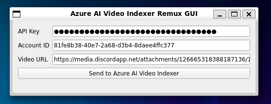

# Azure AI Video Indexer Remux GUI

A Python/PyQt app for muxing Azure AI indexed subtitles/chapters into videos. In active development, to implement major features in future commits

### To-Do List
- [x] Develop Azure Video Indexer API functions
- [x] Create PyQt GUI for application
- [ ] Implement API-calling functionality from within GUI
- [ ] Report Azure AI indexing progress in GUI
- [ ] Mux subtitles into video and save locally as MKV
- [ ] Persist user configuration in local storage
- [ ] Add customizable output (JSON/.srt/transcript) to locally save with MKV

